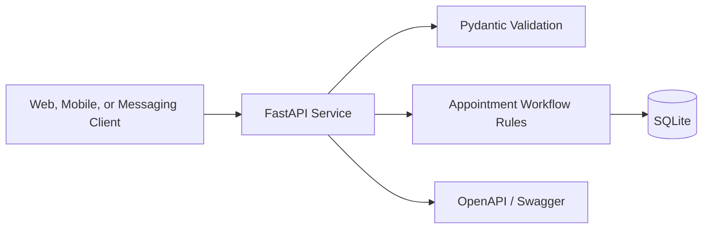
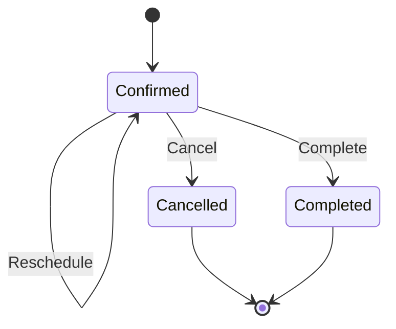

# Appointment Workflow API Demo

A production-style FastAPI demonstration for real-time appointment workflows.
It supports single-service and combo-service bookings without exposing any
private production code, customer data, credentials, or infrastructure details.

## Features

- Create real appointments with one or multiple services
- Reschedule active appointments
- Cancel appointments with lifecycle safeguards
- Filter appointments by status
- SQLite persistence
- Automatic OpenAPI and Swagger documentation
- Docker and Docker Compose support
- API lifecycle tests

## Architecture



## Appointment lifecycle



## Run locally

```bash
python -m venv .venv
source .venv/bin/activate  # Windows: .venv\Scripts\activate
pip install -r requirements.txt
uvicorn app.main:app --reload
```

Open:

- Swagger UI: `http://localhost:8000/docs`
- Health check: `http://localhost:8000/health`

## Run with Docker

```bash
docker compose up --build
```

## Example request

```bash
curl -X POST http://localhost:8000/appointments \
  -H "Content-Type: application/json" \
  -d '{
    "customer_name": "Demo Customer",
    "customer_phone": "+212600000000",
    "services": ["Haircut", "Color"],
    "starts_at": "2026-08-01T10:00:00+01:00",
    "notes": "Combo-service demonstration"
  }'
```

## Test

```bash
pytest
```

## Privacy

This repository is an original demonstration project. It documents engineering
capability without publishing proprietary source code, customer information,
secrets, IP addresses, or third-party credentials.
